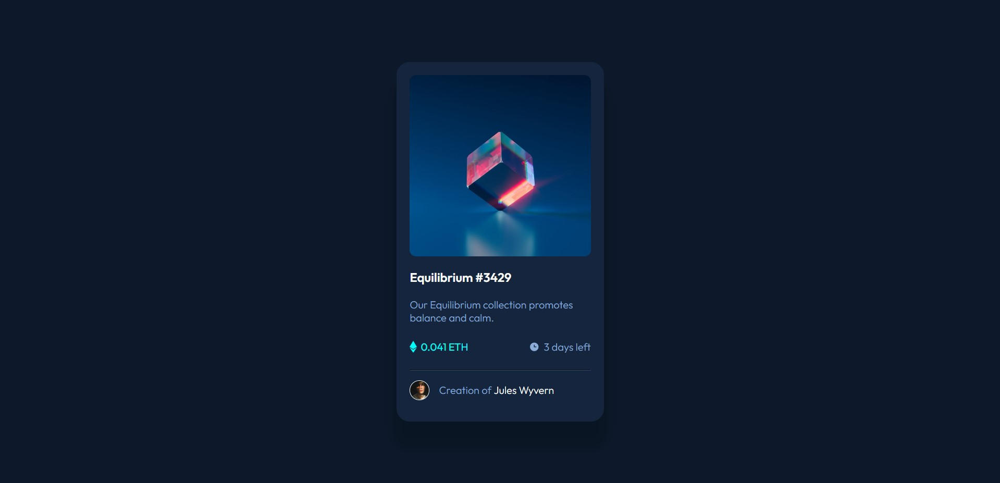

# Frontend Mentor - NFT preview card component solution

This is a solution to the [NFT preview card component challenge on Frontend Mentor](https://www.frontendmentor.io/challenges/nft-preview-card-component-SbdUL_w0U). Frontend Mentor challenges help you improve your coding skills by building realistic projects. 

## Overview

### The challenge

Users should be able to:

- View the optimal layout depending on their device's screen size
- See hover states for interactive elements

### Screenshot



### Links

- Solution URL: https://github.com/RaphaelGusmao96/mentor2
- Live Site URL: https://raphaelgusmao96.github.io/mentor2/

### Built with

- Semantic HTML5 markup
- CSS custom properties
- Flexbox
- CSS Grid

### What I learned

hiding images and icons behind and using ":hover", improving on the concepts "margin" and "padding" and changing the cursor.

```html
  <div class="flex">
          <div class="eth">
            
            <p>0.041 ETH</p>
          </div>
          <div class="clock">
            
            <p>3 days left</p>
          </div>
```
```css
.img-view img {
    position: absolute;
    width: 50px;
    left: 50%;
    top: 50%;
    transform: translate(-50%, -50%);

}

.img-top:hover .img-view {
    display: block;
    cursor: pointer;
}

.text-box #title {
    color: hsl(0, 0%, 100%);
    text-decoration: none;
    font-weight: 600;
    font-size: 19px;
    padding: 20px 0;
    display: inline-block;

}

.text-box #title:hover {
    color: hsl(178, 100%, 50%);
```
## Author
- Frontend Mentor - [@RaphaelGusmao96](https://www.frontendmentor.io/profile/RaphaelGusmao96)

